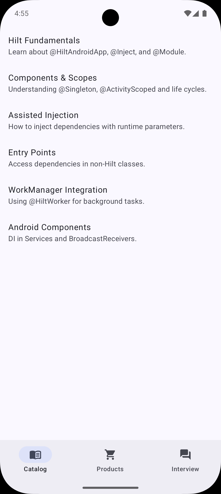

# Hilt Integration App

A modern Android application demonstrating **Hilt Dependency Injection** best practices with Jetpack Compose, WorkManager, and Room.

## Features

- **Hilt Catalog**: Explore core Hilt concepts like `@Inject`, `@Module`, and `@AssistedInject`.
- **Product Store**: Real-world example of fetching data from a REST API (FakeStore) and persisting it locally with Room.
- **Interview Hub**: Study common Android and DI interview questions with an adaptive UI.
- **Modern Architecture**: Clean Architecture with Repository pattern and Offline-first strategy.
- **Adaptive Layouts**: Support for different screen sizes using Material 3 Adaptive library.
- **Testing**: Comprehensive Unit and Hilt-powered Instrumented tests.

## Screenshots

| Catalog List | Catalog Detail |
| :---: | :---: |
|  |  |

| Products | Interview Hub |
| :---: | :---: |
|  |  |

## Tech Stack

- **UI**: Jetpack Compose, Material 3 Adaptive
- **DI**: Dagger Hilt
- **Network**: Retrofit, OkHttp, Moshi
- **Database**: Room
- **Threading**: Kotlin Coroutines & Flow
- **Background Task**: WorkManager
- **Navigation**: Navigation 3

## Getting Started

1. Clone the repository.
2. Open in Android Studio.
3. Build and run the `:app` module.
4. Run tests using `./gradlew test` and `./gradlew connectedAndroidTest`.
